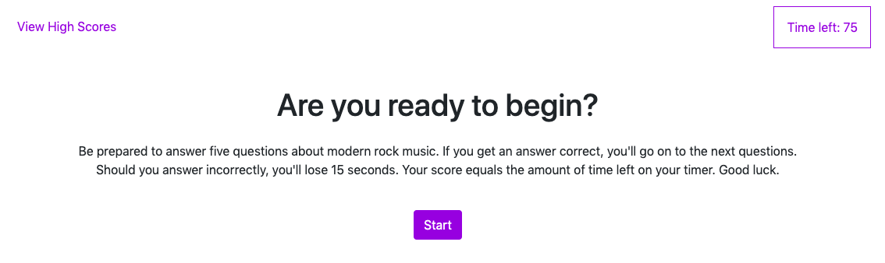
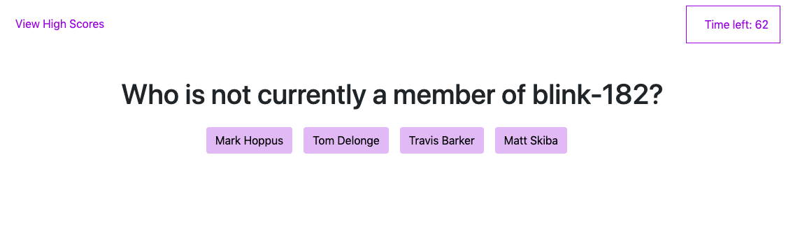
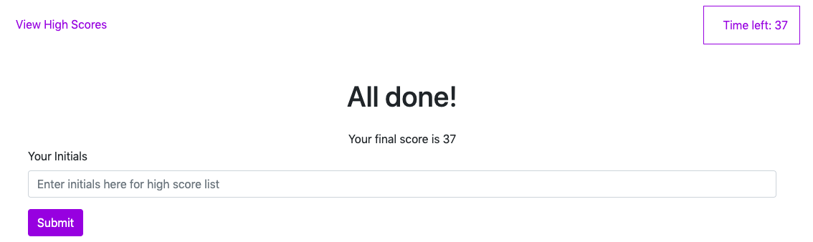

# 04-Timer-Questions-Game

Well that was a challenging activity. I'm really pleased to have gotten what I got. I took a few different approaches to building this out and learned a lot through the grind of building this. I think my code could be simpler, but I'm definitely happy with how the product performs.

The goal was to create a timed question game where a wrong answer deducts 15 seconds from the timer. at the end of the game, your high score should be saved to local storage.

Links:
* [Repository](https://github.com/colinstevens06/04-Timer-Questions-Game)
* [Live page](https://colinstevens06.github.io/04-Timer-Questions-Game/) 

Here are the different elements that I used to build this:

## The Timer

I setupt the timer so that it appears dynamically via JQuery in the upper right. it decreases by 1 every second. When it gets to zero, it stops. When the user answers the final question, it stops and the value of the timer is returned as the score

## Creating Each Questions/Answer Segment

I created each segment using an object for the questions/answers, and a for loop to create the buttons and populate the content of those buttons.

This was the most challenging part of the homework for me.

My first approach was to create a for loop to populate the questions, then use a nested for loop to create buttons. This caused me a lot of problems. I had 12+ buttons appearing sometimes when I only wanted 4! I hadn't worked with nested for loops yet so, after taking a walk to refocus, I decided another approach was needed. During my walk I was pseudocoding in my head and I decided I could definitely make different functions for each question and get it to work w/ a for loop to create the buttons, so I went with that approach.

It worked.

Fairly soon, I had my question/answer segments populating

## Troubleshooting W Mentors

Working by yourself is very hard. Figuring out these problems by yourself is very hard. Having someone there who can answer questions on stuff that you've come to a dead end on is invaluable. This makes me recognize that on my job hunt, I want to work at a place with senior developers who will be there to help. I want to make sure there is some form of mentorship or peer mentorship at my next gig. So important.

## Local Storage

This part still trips me up. I need to go back and redo this activities again. I got the code to work but I'm not 100% on it and happy with it.

What I did gain big time from the local storage was troubleshooting points. I went through a few variations of this before I settled. and I hit some troubleshooting points that i recognized from previous mistakes and was able to fix it. like naming a variable and a function the same thing. I did it again, but quickly noticed the error while debugging. i spent a lot of time debugging this section with debugger and console.log. learned a lot through the process

## Post Partum

I've sliced and diced this up a few times now. I actually created a third javascript file and redid the script based on an example our TA sent us. It's much simpler than the approach I took. And I learned a ton going through that example. What I learned specifically: the power of hiding/showing different content sections, and how you can still increase a counter variable without using a for loop. 

## Screenshots

